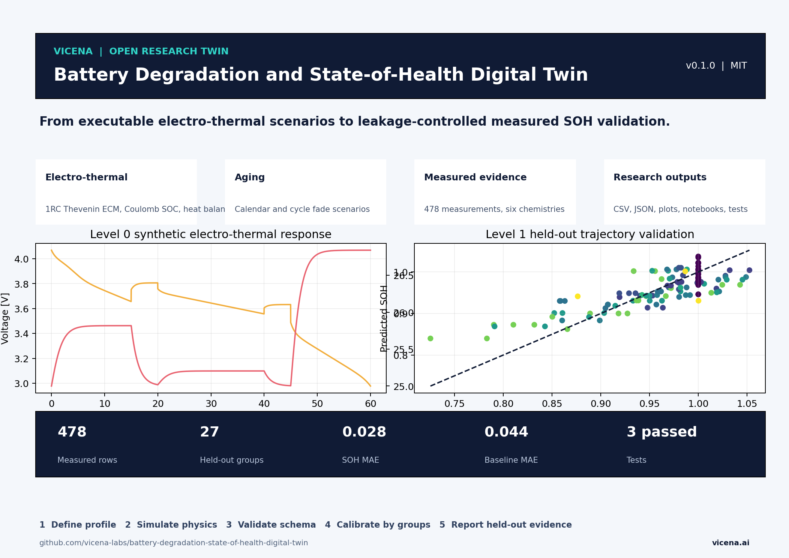

<p align="center"><a href="https://vicena.ai"><strong>VICENA</strong></a></p>
<p align="center"><strong>Built with Vicena</strong><br>Vicena is a scientific research workspace that combines AI-assisted research, durable project files, Jupyter notebooks, reproducible computation, literature tools, and protected remote scientific compute in one environment.</p>

[](LICENSE) [](pyproject.toml) [](https://github.com/vicena-labs/battery-degradation-state-of-health-digital-twin/actions)

# Battery Degradation and State-of-Health Digital Twin

An open-source battery research twin for SOC, terminal voltage, heat generation, temperature, calendar and cycle aging scenarios, and state-of-health validation against measured multi-chemistry data. It gives battery R&D teams a transparent baseline for testing estimators, comparing aging stressors, preparing experiments, and adding proprietary cell data without rebuilding the workflow.

[Installation](#installation) | [Quick start](#60-second-example) | [Upload data](#upload-your-own-data) | [Examples](examples) | [Documentation](docs/getting-started.md) | [Scientific status](#scientific-status) | [Citation](#citation) | [Contributing](CONTRIBUTING.md) | [AI agent usage](#use-this-repository-with-an-ai-agent) | [License](#license)

[](Battery_Degradation_State_of_Health_Digital_Twin_OnePager.pdf)

## What release 0.1.0 provides

- Level 0: executable 1RC Thevenin equivalent-circuit model, Coulomb SOC, irreversible heat generation, lumped thermal response, and synthetic aging scenarios.
- Level 1: measured calendar-aging ingestion for LCO, LFP, LMO, LTO, NCA, and NMC cells.
- Leakage-controlled validation: entire cell-condition trajectories are held out.
- Research artifacts: executed notebooks, CSV and JSON results, tested Python package, data schema, model card, validation guide, and reproducible A4 one pager.

## Scientific status

| Component | Level | Evidence | Boundary |
|---|---:|---|---|
| Electro-thermal model | 0 | Executable synthetic checks | Illustrative parameters, not cell-calibrated |
| Aging scenario model | 0 | Monotonicity and range tests | Scenario generator, not a mechanistic degradation law |
| Calendar-aging SOH model | 1 | 478 measured records, 108 cell-condition trajectories, 27 held-out groups | Dataset conditions only |

Held-out SOH results: MAE 0.0285, RMSE 0.0363, R2 0.644. The mean-training-SOH baseline MAE is 0.0444. These are repository run results, not universal performance claims. This release is not pack-level, online BMS, safety certification, or production validation.

## Installation

Supported: Linux, macOS, and Windows with Python 3.10 or newer.

```bash
git clone https://github.com/vicena-labs/battery-degradation-state-of-health-digital-twin.git
cd battery-degradation-state-of-health-digital-twin
python -m venv .venv
source .venv/bin/activate  # Windows PowerShell: .venv\Scripts\Activate.ps1
pip install -e .[dev]
```

## 60-second example

```bash
python examples/quickstart.py
```

Expected result: final SOC near 0.618, minimum voltage near 3.644 V, and maximum temperature near 25.82 C for the bundled synthetic profile.

## 10-minute quickstart

```bash
battery-twin simulate --output outputs/profile.csv
battery-twin validate --output outputs/validation.csv
pytest -q
```

Expected result: one synthetic profile, measured held-out predictions, printed metrics, and three passing tests.

## Full research workflow

Run the executed notebooks in order:

1. `notebooks/01_level0_electrothermal_twin.ipynb`
2. `notebooks/02_level1_measured_validation.ipynb`

Then use `scripts/run_validation.py` and `scripts/make_onepager.py` to regenerate reported artifacts. See [getting started](docs/getting-started.md), [model card](docs/model-card.md), [validation guide](docs/validation.md), and [R&D roadmap](docs/roadmap.md).

## Upload your own data

Provide one CSV per chemistry or cell family with the fields in `schemas/calendar_ageing.schema.json`: State-of-Charge [%], Temperature [degC], Cell Identity Number, Days Passed [days], Discharge Capacity [Ah], and Charge Capacity [Ah]. Do not guess missing units, labels, cell identities, or test conditions. Add a new case study and keep the reference dataset unchanged.

## Expected artifacts

Outputs are written to `outputs/`: time histories, held-out predictions, metrics, and PNG plots. The one-page PDF is in the repository root and its preview is under `assets/`.

## Extension contract

Add new physics in `src/battery_twin/`, datasets under a provenance-specific directory, schemas in `schemas/`, complete workflows in `case_studies/`, and regression tests in `tests/`. Every new measured model must separate calibration and validation by physical cell or independent experiment. Report a baseline and uncertainty or residual distribution.

## Versioning and compatibility

The default branch represents the current development release. Tagged releases, documentation, examples, and notebooks share the same version in `VERSION` and `CHANGELOG.md`. Scientific result changes require a changelog entry and rerun of the evidence artifacts.

## Citation

Cite this software using `CITATION.cff`. The measured calendar-aging data are from Zenodo DOI [10.5281/zenodo.6685365](https://doi.org/10.5281/zenodo.6685365). Additional impedance data are archived for future extension from LiBforSecUse DOI [10.5281/zenodo.6418665](https://doi.org/10.5281/zenodo.6418665).

## Contributing

See [CONTRIBUTING.md](CONTRIBUTING.md). Scientific contributions must preserve dataset provenance, group-separated evaluation, dimensional checks, and honest validation labels.

## Use this repository with an AI agent

```text
Clone https://github.com/vicena-labs/battery-degradation-state-of-health-digital-twin.git. Read AGENTS.md, AGENT_PLAYBOOK.md, and the repository skill under .agents/skills/. Run the documented smoke test and baseline example without changing the model. Summarize what is implemented, what is synthetic, what has been validated, and what data are required to adapt the twin. Then ask me for the dataset or engineering objective before making scientific changes.
```

```text
Clone https://github.com/vicena-labs/battery-degradation-state-of-health-digital-twin.git and treat it as an existing scientific software project. Read AGENTS.md, AGENT_PLAYBOOK.md, the repository skill, the data contract, model card, and validation guide. Verify the environment, run the tests, and reproduce the baseline output first. Validate my uploaded data against the documented schema without guessing missing units or metadata. Create a new project or case study rather than overwriting the reference example. Calibrate only on the declared calibration split, evaluate on held-out physical cells or independent experiments, report uncertainty and limitations, and preserve reproducibility. Do not call the result a production digital twin unless the validation criteria are satisfied.
```

## Using this repository with Vicena

Open [vicena.ai](https://vicena.ai), paste `https://github.com/vicena-labs/battery-degradation-state-of-health-digital-twin.git`, and use either prompt above. Local features remain standard Python workflows and do not require a Vicena account.

## License

Code and repository-authored documentation are MIT licensed. Third-party datasets retain their source terms and attribution requirements. See `datasets/DATA_SOURCES.md`.
